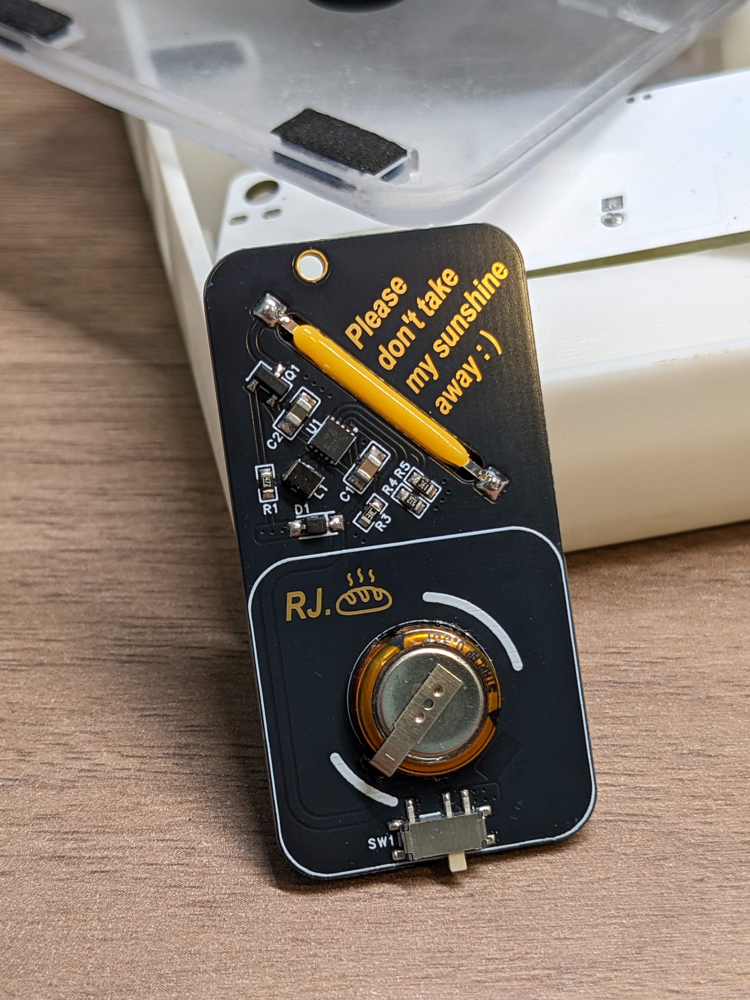
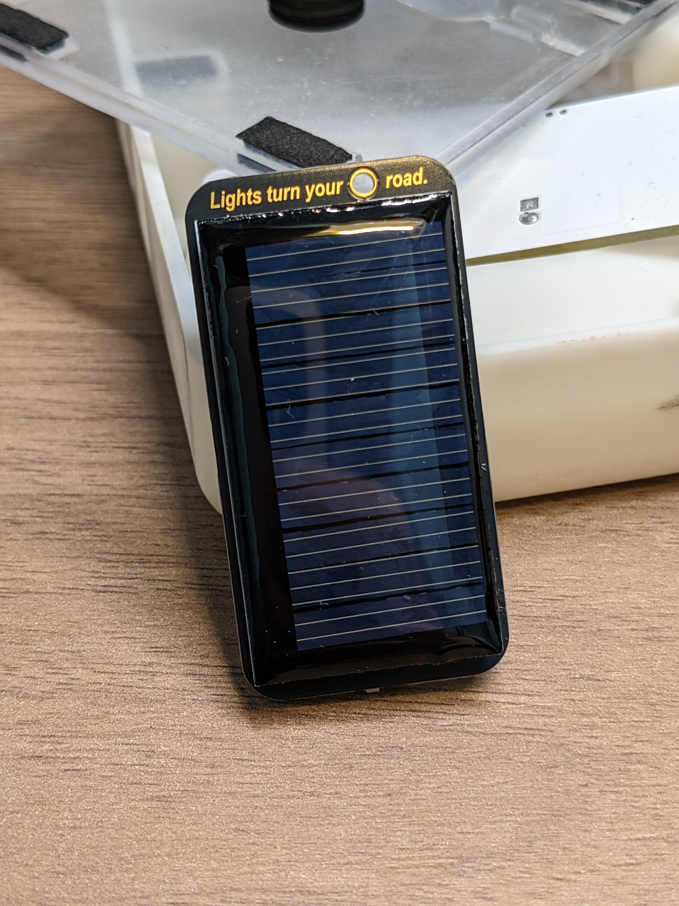
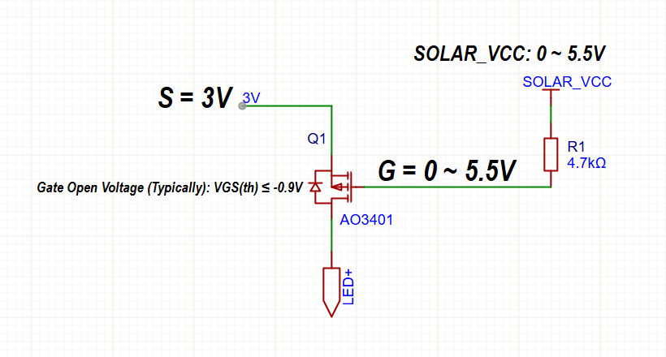

# Log
>
>
>
>`--2025.1.23--` 
&emsp; epro工程文件中的Beta.1是错误的，有一个broken的Mark。Beta.2和Beta.3正常，Beta.2和Beta.3的区别在于Beta.3的超级电容是沉板放置，减少超级电容在体积上的突出，同时改善整体的重心分配，但是制作工作量和难度会增加。Beta.2会相对简单一些，但是会存在前面提到的问题。

 

# 简介
&emsp;&emsp;一个简单的太阳能LED模块，可以根据环境光自动控制LED的开启或关闭。
 

<figure class="half">
  
  
</figure>
 
 

# 实现效果
&emsp;&emsp;5.5V太阳能板为5.5V 0.33F超级电容充电，同时为TPS63900升降压IC供电，TPS63900对输入电压进行升压或降压，固定输出3V为LED供电。
 
&emsp;&emsp;LED在强光环境下(包括室内强灯光)，关闭；在弱光环境下，开启。
 
 

# LED控制原理
&emsp;&emsp;LED的开关由Q1的PMOS控制。由于太阳能板的特性，在面对不同光强的时候会输出变化的电压。这里将太阳能板作为光敏器件，将太阳能板电压输出接到PMOS的G极上，实现控制PMOS的开关。

 

&emsp;&emsp;假设PMOS的VGS开启电压`-0.9V`，太阳能板输入电压范围为`0 ~ 5.5V`，S极为TPS63900输出的`3V`。则VGS的电压范围= `-3 ~ 2.5V`，产生两种情况：
&emsp;
+ G极电压低于-0.9V的情况下PMOS开启，LED亮；
+ G极电压高于-0.9V的情况下PMOS关闭，LED灭。

&emsp;&emsp;实现LED的自适应开启和关闭。

 

# 制作文档
（待施工）

 
 

# Enjoy!😎

